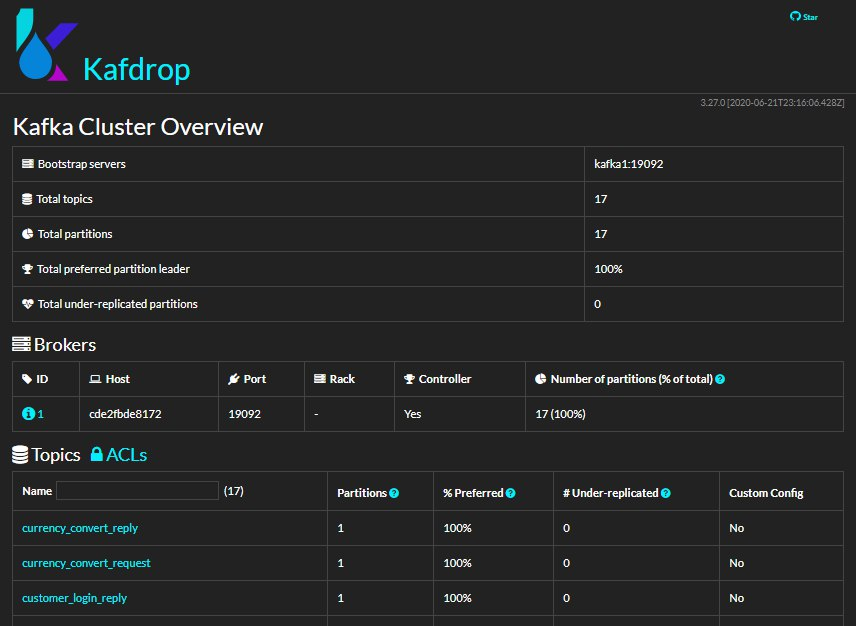

## Getting Started with Kafka:

Here is explained how to can install and run Kafka on Docker Container.
For this project are used: 
 - **Apache Kafka:** for using messaging for communication between Microservices 
 - **Zookeeper:** for maintaining centralized configuration information, naming, providing distributed synchronization, and providing group services in a simple interface so that we don't have to write it from scratch.
 - **Kafdrop:** for viewing Kafka topics and browsing consumer groups. The tool displays information such as brokers, topics, partitions, consumers, and lets you view messages. [More info](https://github.com/obsidiandynamics/kafdrop)

### How to install and run them?
 1. First of all, install docker on your OS. [find great guide in own website](https://docs.docker.com/get-started/overview)
 2. Open shell in root of Kafka directory 
 3. Run ```docker-compose up -d``` 
 4. When you want to stop container, you can run ``` docker-compose down``` in shell.
 5. For monitoring in your system with ```localhost:9000``` you will access to Kafdrop tool.


