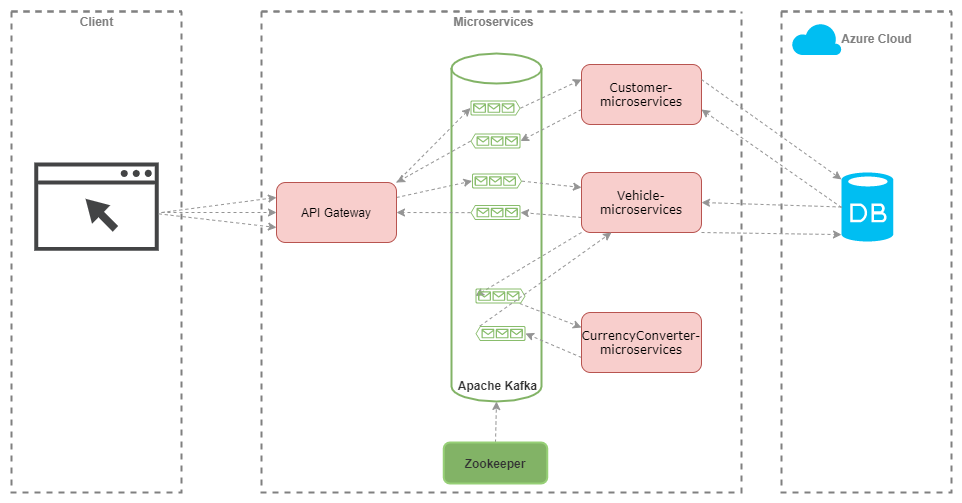

This is a project for lecture "Service Engineering".

# Sprint 1:
It inclueds two webservices and an application.

- **Car Rental webservice:** This is a central webservise where provides different cars.
- **Currency Converter:** It is a converter which receives the actuel rate from european bank and converts it to dollar.
- **Client Application:** It could be implemented as a mobile app or a web app.

# Sprint 2:

- Redesign project and implement as Microservices Architecture
- Use Apache Kafka for communication between Microservices
- Use MongoDB instead of relational DB
- Use docker for containerizing
- Deploy DB container on Microsoft Azure and Microservices on AWS

## Architecture:

### Microservices Architecture

### Microservices Architecture with Load Balancer

### Sequence diagram

- It's an event driven architecture implementation with multiple microservices each having its own responsibility and configured to respond on certain events like "CustomerService" and "VehicleService"
- Used **Apache Kafka** as message broker for communication b/w these microservices
- **Angular/Typescript** for client apps, used http as the communication protocol between the client apps and the microservices.
- **API Gateway** plays a communication role between client apps and other microservices. It provides RESTful API as well.

## General specifications:
- Apache Kafka, Zookeeper & Kafdrop (Kafka Web UI)
- Cloud: AWS cloud services platform - AWS CloudFormation IaC Service
- Database: MongoDB on Microsoft Azure
- Container: Docker
- Subversion: GIT, Code Review tool and GIT flow
- IDE: IntelliJ IDEA, Visual Studio Code (frontend)

## Prerequisites:
- Java 11
- Spring Boot 2.4.4
- Maven 3.6.3
- Angular 7.0
- Docker & Docker-Compose
- Kafka Installation
- Zookeeper Installation

## More Details:

**[Car Rental Microservices details](CarRental/)**

**[Currency Converter Microservice details](CurrencyConverter/)**

**[Front-End details](Client/)**

**[How to run Kafka in Container?](Kafka/)**
